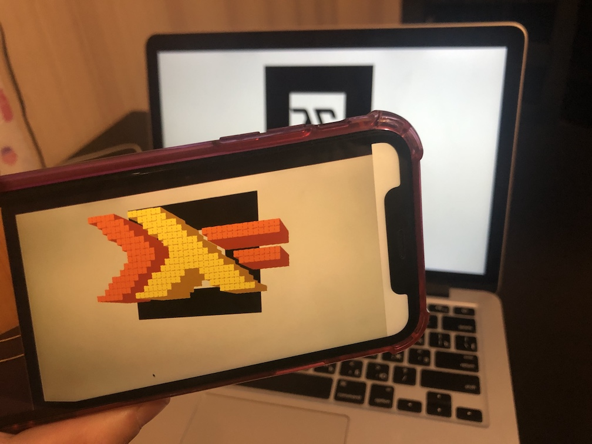

# Preparation instructions

## Get the stuff

Clone this repository:

```sh
git clone https://github.com/fizruk/lambdaconf-2019-workshop.git
```

Pull docker image:

```sh
docker pull fizruk/stack-ghcjs:ar-cube
```

## Make sure everything is fine

Just to make sure everything is fine, build the project
(this may take a couple minutes first time):

```sh
cd lambdaconf-2019-workshop/
./with-docker.sh build
```

Now run server:

```sh
./with-docker.sh run
```

You should see an output similar to this:

```
Starting ar-cube-server...
============================================================
Static files (VR) served from /project/.stack-work/install/x86_64-linux/lts-7.19/ghcjs-0.2.1.9007019_ghc-8.0.1/bin/ar-cube-client-vr.jsexe/
Static files (AR) served from /project/.stack-work/install/x86_64-linux/lts-7.19/ghcjs-0.2.1.9007019_ghc-8.0.1/bin/ar-cube-client-ar.jsexe/
Starting ar-cube-server at https://10.218.135.182:8019
------------------------------------------------------------
Local VR at https://localhost:8019/vr/vr.html
Open VR at https://10.218.135.182:8019/vr/vr.html
Open AR at https://10.218.135.182:8019/ar/ar.html
AR marker (open on desktop) at
https://localhost:8019/ar/assets/markers/lc-2019-marker.png
------------------------------------------------------------
```

You can now open [AR marker][ar_marker] on your desktop, open application
on your smartphone (using whatever local IP address you computer has),
allow the app to use smartphone's camera and point it to the marker on
your desktop!

[ar_marker]: project/ar-cube-client/static/assets/markers/lc-2019-marker.png

![AR marker.][ar_marker]

The result should look like this:



## Troubleshooting

On Linux might have to install `ifconfig`, for instance on Ubuntu:

```
apt-get update
apt-get install net-tools
```

You might also need to add yourself to the `docker` group.
See [this answer on AskUbuntu](https://askubuntu.com/a/477554)
that might help.
