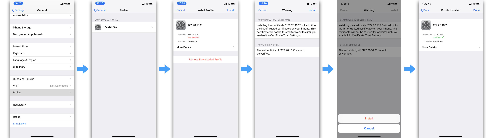
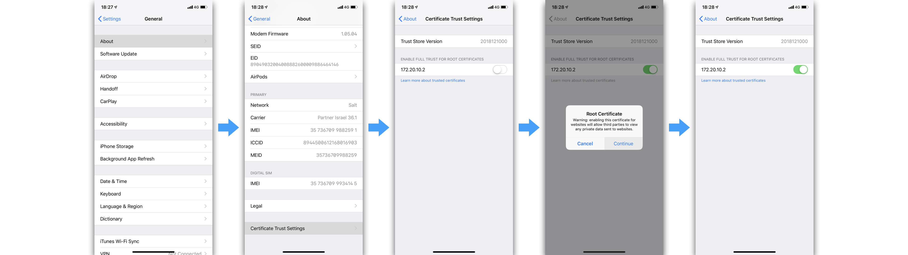

# Preparing and installing SSL certificates

When running a local server and connecting to it
you might see SSL certificate errors like this:


While you can fix this for standalone clients, it does not work
for websockets (which are used for client-server communication).

This document describes how to properly install SSL certificates
so that you can test multiplayer AR on your devices with a local server!

## A note for public servers

You can do the procedure described here with self-signed certificates
for public servers as well, but since it is very easy to generate
proper SSL certificates with [Let's Encrypt](https://letsencrypt.org/getting-started/),
I recommend to do that instead!

## Generating server SSL certificate

First, you need to decide which network you are going to use and
what IP address your server will have in that network.
For instance, you might use a WiFi network shared by your laptop
and a phone, or set up a personal WiFi hotspot. In any case
you will need to figure out what your server's IP address will be in that
network.

You can use `gen-ssl-cert` script to try figure out that automatically:

```
./with-docker.sh gen-ssl-cert
```

If it can guess an IP address based on `ifconfig` output,
you will see something like

```
Generating SSL certificate for IP address 10.226.109.4
...
```

Otherwise you will be asked to provide options for the certificate manually.
You can skip all fields except for Common Name which should match the IP address
exactly:

```
...
Country Name (2 letter code) [AU]:
State or Province Name (full name) [Some-State]:
Locality Name (eg, city) []:
Organization Name (eg, company) [Internet Widgits Pty Ltd]:
Organizational Unit Name (eg, section) []:
Common Name (e.g. server FQDN or YOUR name) []:10.226.109.4
...
```

Generated certificate should be located at
[project/certificate.pem](project/certificate.pem).

## Installing SSL certificate

Now you have to share generated certificate with the smartphone(s)
you will use for development. You can email it or use other means
(such as AirDrop on iOS devices).

### iOS

Here are the necessary steps to install a certificate on iOS 12.

#### Step 1. Download certificate

Share certificate over AirDrop, open it in an email or otherwise get to the phone.
If asked where to install it — install on the device you are going to use for AR:


#### Step 2. Install certificate

Go to Settings > General > Profiles.
Open recently downloaded profile and install it:



#### Step 3. Trust certificate

Now we have to let iOS device trust newly installed certificate.
For that go to Settings > General > About > Certificate Trust Settings.
You should see installed certificate for your server IP address.
Enable trust for this certificate:



#### Step 4. Verify that everything is fine

Launch your server and open application in mobile browser.
For an AR application it should ask permission to use camera
and open without any SSL warnings:


